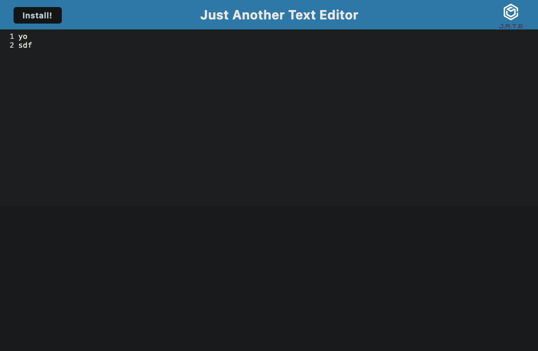

# PWA Text Editor

Ryan Hanzel

Module 19 Assignment | BootCamp @ UT Austin

## Description

This app is a single page text editor and is also a progressive web application. The app uses the node module IndexedDB database for the data storage.

## Usage

- Clone this repo and cd into the repo's root folder with your cli application.
- Run the command `npm install` and `npm run build`.
- Run the command `npm run start`
- Open your web browser and open the url `http://localhost:3000`.

## Links

[GitHub](https://github.com/h3xivall/pwa-text-editor)
[Deployed App](https://pwa-text-editor-t3sw.onrender.com)

## Screenshots
